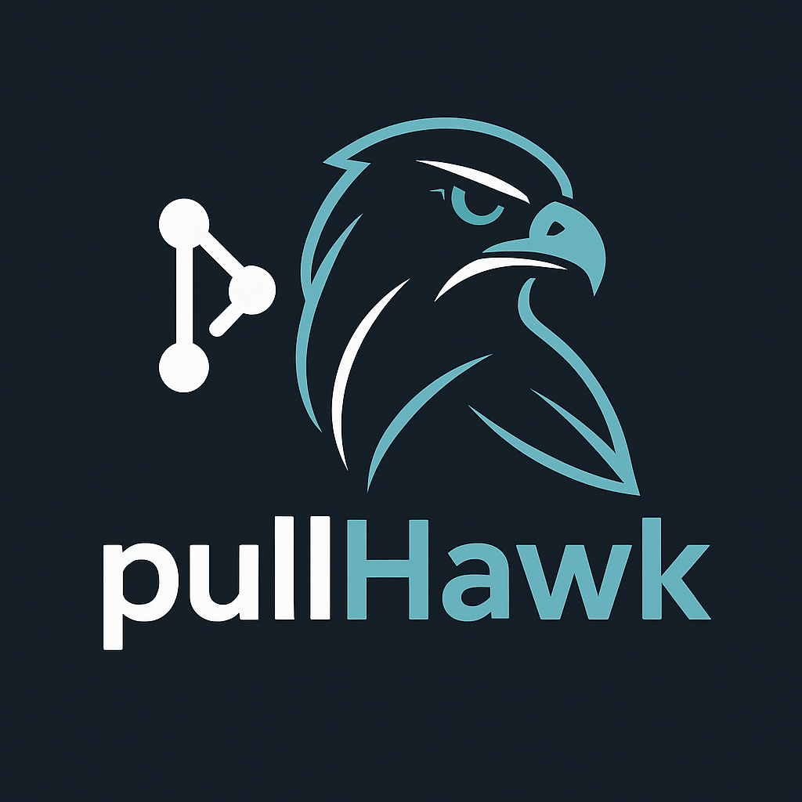
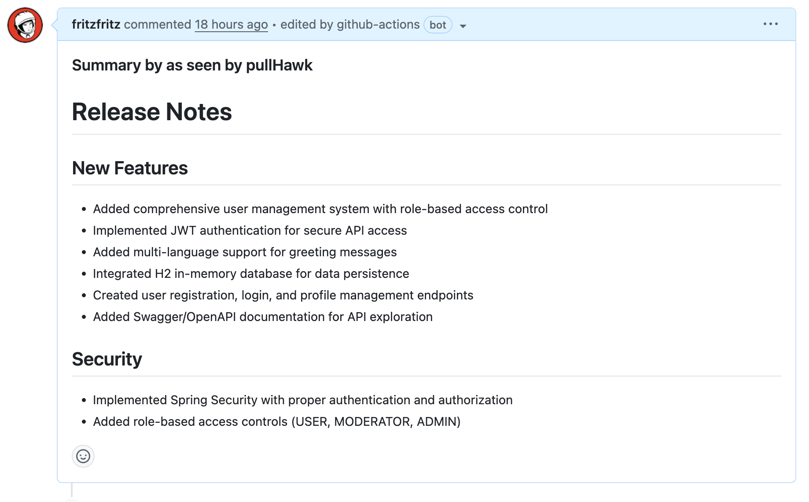
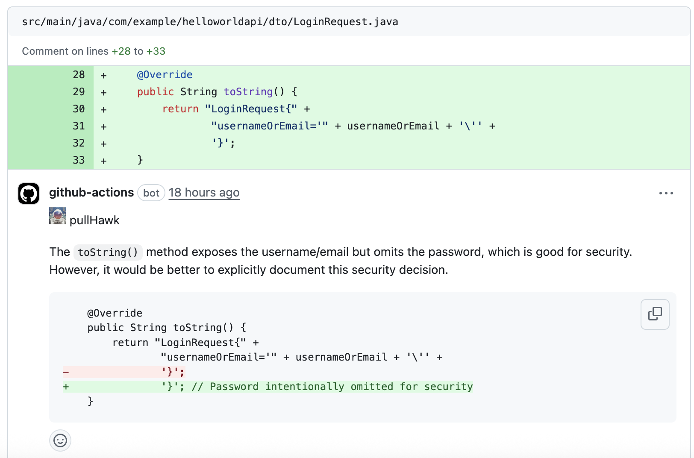

# pullHawk - AI-powered Code Reviewer

 (Alexander Stiefel,
alexander.stiefel@t-systems.com)

🦅 **Privacy-First AI Code Review for GitHub Pull Requests**

pullHawk is an AI-powered code reviewer and summarizer for GitHub pull requests,
designed specifically for teams who need **private, secure, and self-hosted LLM
solutions**. Born from the foundation of [CodeRabbit](http://coderabbit.ai),
pullHawk addresses the critical need for organizations that cannot send their
proprietary code to external AI services.

[](https://opensource.org/licenses/MIT)
[](https://github.com/conmob-ai/pullhawk/commits/main)

## 🎯 Why pullHawk?

**Privacy & Security First**: Many organizations cannot use cloud-based AI
services like OpenAI due to:

- Corporate security policies
- Data compliance requirements (GDPR, HIPAA, SOX)
- Intellectual property protection
- Regulatory restrictions
- Air-gapped environments

**pullHawk solves this** by working with your private, self-hosted LLM
infrastructure while maintaining all the intelligent code review capabilities
you need.

## 🚀 Key Features

- **🔒 Private LLM Integration**: Works with self-hosted models (Ollama, vLLM,
  LocalAI, etc.)
- **📋 PR Summarization**: Generates comprehensive summaries and release notes
- **🔍 Line-by-line Reviews**: Provides detailed code change suggestions
- **⚡ Incremental Reviews**: Reviews each commit, not just the final state
- **💰 Cost-Effective**: No per-token charges - use your own infrastructure
- **🎯 Smart Review Skipping**: Avoids noise by skipping trivial changes
- **💬 Interactive Chat**: Conversation with the bot for context and
  explanations
- **🛠️ Customizable Prompts**: Tailor reviews to your team's standards
- **🌐 Multi-Model Support**: Switch between different private models for
  different tasks

## 🏗️ Architecture

pullHawk is designed to work in secure environments:

```
GitHub → pullHawk Action → Your Private LLM → Secure Reviews
```

**No external API calls** • **No data leakage** • **Full control**

## 📦 Installation

Add the workflow file to your repository at `.github/workflows/pullhawk.yml`:

Below is an example of a workflow file that uses pullHawk in a STRIVE project
environment.

```yaml
name: Code Review

permissions:
  contents: read
  pull-requests: write

on:
  pull_request:
  pull_request_review_comment:
    types: [created]

concurrency:
  group:
    ${{ github.repository }}-${{ github.event.number || github.head_ref ||
    github.sha }}-${{ github.workflow }}-${{ github.event_name ==
    'pull_request_review_comment' && 'pr_comment' || 'pr' }}
  cancel-in-progress: ${{ github.event_name != 'pull_request_review_comment' }}

jobs:
  review:
    runs-on: ubuntu-latest
    steps:
      - uses: conmob-ai/pullhawk@latest
        env:
          GITHUB_TOKEN: ${{ secrets.GITHUB_TOKEN }}
          OPENAI_API_KEY: ${{ secrets.OPENAI_API_KEY }}
          STRIVE_PROJECT_NAME: ${{ secrets.STRIVE_PROJECT_NAME }}
        with:
          debug: false
          review_simple_changes: false
          review_comment_lgtm: false
          openai_light_model: GPT-4o Mini
          openai_heavy_model: Claude 3.7 Sonnet
          openai_base_url:
            https://aie-striveyard.devops.t-systems.net/api/chat-proxy/v2/projects/${{
            env.STRIVE_PROJECT_NAME }}/v2/
          bot_icon:
            ''
```

## 🔧 Environment Variables

### Required

- `GITHUB_TOKEN`: GitHub Actions token for PR comments (automatically available)
- `OPENAI_API_KEY`: Your AI service API key for the T-Systems proxy
- `STRIVE_PROJECT_NAME`: Your project name in the T-Systems AI gateway (e.g.,
  "PROCAST")

### Configuration Options

- `openai_base_url`: Custom AI proxy endpoint (e.g., T-Systems AI Gateway)
- `openai_light_model`: Lightweight model for summaries (e.g., "GPT-4o Mini")
- `openai_heavy_model`: Advanced model for detailed reviews (e.g., "Claude 3.7
  Sonnet")
- `bot_icon`: Custom icon for the review bot

## 🤖 Supported Private LLM Providers

pullHawk works with any OpenAI-compatible API, including:

- **[Ollama](https://ollama.ai/)** - Local LLM runner
- **[vLLM](https://vllm.readthedocs.io/)** - High-performance inference server
- **[LocalAI](https://localai.io/)** - OpenAI alternative
- **[Text Generation WebUI](https://github.com/oobabooga/text-generation-webui)** -
  Web interface for LLMs
- **[LM Studio](https://lmstudio.ai/)** - Desktop LLM application
- **Custom implementations** - Any OpenAI-compatible endpoint

in case of using public LLM providers, the use of openrouter.ai is recommended.

## 📝 Model Recommendations

For optimal performance, we recommend using different models for different
tasks:

| Task              | Recommended Models                | Purpose                           |
| ----------------- | --------------------------------- | --------------------------------- |
| **Summarization** | CodeLlama 7B, Mistral 7B          | Fast, lightweight summaries       |
| **Code Review**   | CodeLlama 34B, DeepSeek Coder 33B | Detailed analysis and suggestions |
| **Chat/Q&A**      | Llama 2 13B, Mistral 7B Instruct  | Interactive conversations         |

## 💬 Chat with pullHawk

Interact with pullHawk by mentioning it in review comments:

```
@pullhawk Please explain the performance implications of this change.

@pullhawk Generate unit tests for this function.

@pullhawk What are the security considerations here?
```

## 🚫 Ignoring Pull Requests

To skip review for specific PRs, add this to the PR description:

```text
@pullhawk: ignore
```

## 🛡️ Security & Privacy Benefits

### ✅ What stays private:

- ✅ Your source code never leaves your infrastructure
- ✅ No third-party AI service dependencies
- ✅ Full audit trail of AI interactions
- ✅ Compliance with corporate security policies
- ✅ Works in air-gapped environments

### ⚠️ CodeRabbit vs pullHawk:

| Feature           | CodeRabbit              | pullHawk                |
| ----------------- | ----------------------- | ----------------------- |
| **Privacy**       | ❌ Sends code to OpenAI | ✅ Private LLM only     |
| **Cost**          | 💰 Per-token pricing    | ✅ Your infrastructure  |
| **Compliance**    | ⚠️ External dependency  | ✅ Full control         |
| **Customization** | ⚠️ Limited models       | ✅ Any model you choose |

## 🎨 Examples

 _Example summary generated by
pullHawk using private LLM_

 _Line-by-line review with
security-conscious analysis_

## 🤝 Contributing

### Development Setup

Requirements: Node.js 17+

```bash
# Install dependencies
npm install

# Build and package
npm run build && npm run package

# Run tests
npm test
```

## 🏗️ Building and Releases

pullHawk uses an automated CI/CD pipeline to ensure consistent builds and easy
releases.

### 🔄 Automated CI/CD Pipeline

Our GitHub Actions workflow automatically:

- **🧪 Tests & Linting**: Runs on every PR and push to main
- **📦 Building**: Compiles TypeScript and packages with ncc
- **🚀 Releases**: Creates GitHub releases when version tags are pushed
- **🏷️ Version Management**: Maintains major version tags (v1, v2, etc.)

### 📋 Workflow Triggers

| Event                 | Action                                |
| --------------------- | ------------------------------------- |
| **Pull Request**      | ✅ Test, lint, and build verification |
| **Push to main**      | ✅ Full build with artifact upload    |
| **Version tag** (v\*) | ✅ Complete release process           |

### 🚀 Creating a Release

#### For Maintainers:

1. **Prepare the release:**

   ```bash
   # Ensure all changes are committed and pushed
   git checkout main
   git pull origin main

   # Update version if needed (optional, can be any semantic version)
   npm version patch  # or minor, major
   ```

2. **Create and push a version tag:**

   ```bash
   # Create a new version tag
   git tag -a v1.2.3 -m "Release v1.2.3: Add feature XYZ"

   # Push the tag to trigger the release workflow
   git push origin v1.2.3
   ```

3. **The automation handles the rest:**
   - ✅ Runs all tests and builds
   - ✅ Creates GitHub release with auto-generated changelog
   - ✅ Uploads packaged artifacts (ZIP file)
   - ✅ Updates major version tag (e.g., `v1` → latest `v1.x.x`)
   - ✅ Updates README examples with new version

#### Release Artifacts:

Each release includes:

- **📦 Source code** (automatically by GitHub)
- **🗜️ Packaged action** (`pullhawk-v1.2.3.zip`) with built `dist/` and `lib/`
  folders
- **📋 Auto-generated changelog** from git commits
- **🏷️ Major version tag** for easy consumption

### 🎯 Version Management

pullHawk follows **semantic versioning** (SemVer):

- **Major** (v2.0.0): Breaking changes
- **Minor** (v1.1.0): New features, backward compatible
- **Patch** (v1.0.1): Bug fixes, backward compatible

#### Using Different Versions:

```yaml
# Recommended: Use major version tag (auto-updates to latest patch/minor)
- uses: conmob-ai/pullhawk@v1

# Specific version (pinned, won't auto-update)
- uses: conmob-ai/pullhawk@v1.2.3

# Development: Use specific commit (for testing unreleased features)
- uses: conmob-ai/pullhawk@abc123def456

# Latest release (not recommended for production)
- uses: conmob-ai/pullhawk@latest
```

### 🛠️ Manual Development Build

For local development and testing:

```bash
# Full build and test cycle
npm run all

# Individual steps
npm run build      # Compile TypeScript
npm run package    # Bundle with ncc
npm run test       # Run tests
npm run lint       # Check code style
npm run format     # Fix formatting

# Test locally with act (GitHub Actions locally)
npm run act
```

### 📊 Build Artifacts

After building, you'll find:

```
pullhawk/
├── dist/           # Bundled action (ncc output)
│   ├── index.js    # Main bundled file
│   └── tiktoken_bg.wasm
├── lib/            # Compiled TypeScript
│   ├── main.js
│   └── *.js files
└── node_modules/   # Dependencies
```

### 🔍 Troubleshooting Builds

**Common issues:**

- **TypeScript errors**: Check `tsconfig.json` and fix type issues
- **Test failures**: Run `npm test` locally to debug
- **Package errors**: Ensure all dependencies are properly installed
- **Action not found**: Verify the tag exists and GitHub Actions can access it

**Debug workflow:**

```bash
# Check if the action can be found
git ls-remote --tags origin

# Verify the built files are committed
git status
git diff HEAD -- dist/ lib/
```

## 🙋 FAQ

### Can I use multiple private LLM providers?

Yes! Configure different endpoints for different repositories or use a load
balancer.

### What about performance compared to GPT-4?

Modern code-specific models like CodeLlama 34B provide excellent results.
Performance depends on your model choice and hardware.

### Can I run this in air-gapped environments?

Absolutely! As long as your private LLM is accessible, pullHawk works completely
offline.

### How do I handle model updates?

Simply update your LLM server with new models. pullHawk will automatically use
the updated models.

## 📄 License

MIT License - feel free to adapt for your organization's needs.

## 🙏 Acknowledgments

Built upon the foundation of [CodeRabbit](http://coderabbit.ai) with gratitude
to the original creators. pullHawk extends the vision to privacy-conscious
organizations that need AI-powered code review without compromising security.

---

**Ready to keep your code reviews private?** 🦅

_pullHawk: Where privacy meets intelligent code review._
